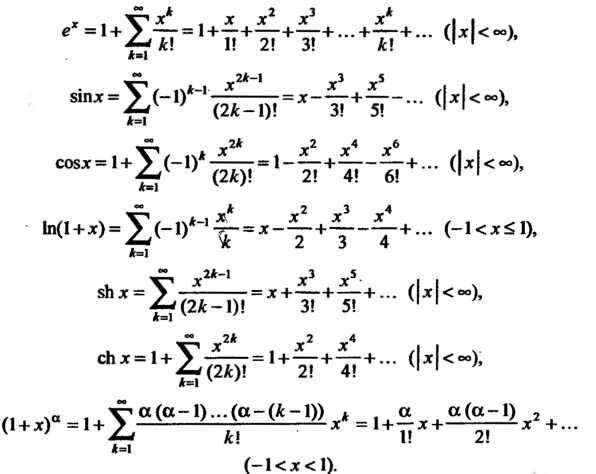

# math.h

This is my implementation of C's programming language <math.h> header

## Abstract

C mathematical operations refer to a collection of functions within the standard library of the C programming language that implement fundamental mathematical operations. These functions all involve floating-point numbers. Various C standards offer different sets of these functions, though they maintain backward compatibility. Functions that deal with angles use radians as the unit of measurement.

### Some "math.h" functions

| No. | Function | Description |
| --- | -------- | ----------- |
| 1 | `int abs(int x)` | computes absolute value of an integer value |
| 2 | `long double acos(double x)` | computes arc cosine |
| 3 | `long double asin(double x)` | computes arc sine |
| 4 | `long double atan(double x)` | computes arc tangent |
| 5 | `long double ceil(double x)` | returns the nearest integer not less than the given value |
| 6 | `long double cos(double x)` | computes cosine |
| 7 | `long double exp(double x)` | returns e raised to the given power |
| 8 | `long double fabs(double x)` | computes absolute value of a floating-point value |
| 9 | `long double floor(double x)` | returns the nearest integer not greater than the given value |
| 10 | `long double fmod(double x, double y)` | remainder of the floating-point division operation |
| 11 | `long double log(double x)` | computes natural logarithm |
| 12 | `long double pow(double base, double exp)` | raises a number to the given power |
| 13 | `long double sin(double x)` | computes sine |
| 14 | `long double sqrt(double x)` | computes square root |
| 15 | `long double tan(double x)` | computes tangent |  

## Implementation info

- This static library is developed in C language of C11 standard using gcc compiler
- Program code follows Google style
- There is full coverage of library functions code with unit-tests with the Check library
- The gcov_report Makefile target generates a gcov report in the form of an html page
- The total accuracy is 16 significant digits
- Accuracy of the fractional part is up to 6 decimal places

**With great thanks to Brook Taylor and Colin Maclaurin**